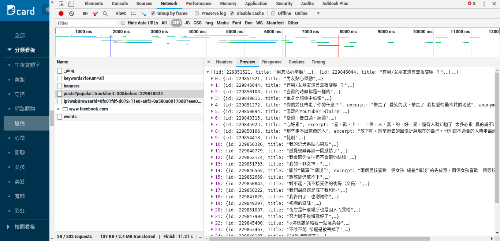
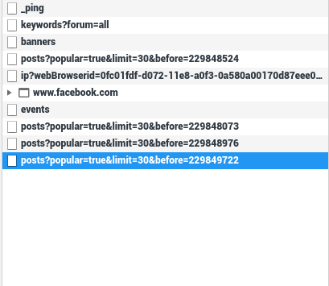

```{r setup, include=FALSE}
knitr::opts_chunk$set(echo = TRUE)
```
***

##  先檢查Dcard的小秘密\^q^

1. 把網頁扒開來看Dcard的小秘密

   

   可以看到Dcard把網頁裡面的標題、部份內容都寫在這個檔案裡面

2. 因為Dcard沒有下一頁的按鈕，所以我們繼續往下滑，看看他是怎麼在滑到底後呼叫出多的內容

   

3. 開始找到一個感覺，以圖片裡的Request URL而言

   > https://www.dcard.tw/_api/forums/relationship/posts?popular=true&limit=30&before=229848524

   1. 「relationship」代表我們在抓的看板，也就是感情~~無病呻吟~~板
   2. 「popular=true」代表我們抓的是熱門文章，把 true 改成 false 的話會照時間順序把文章抓下來，等一下我會用照時間順序的方法來抓，因為這樣比較好找每篇文章的id，而且是否熱門我們也可以從 commentCount 和 likeCount 去篩選
   3. 「limit=30」代表一次抓30篇文章，如果不加上這串的話預設就是抓30篇
   4. 「before=229848524」代表抓取文章 id 是 229848524 之前的文章，因為我們只抓一個板，這個文章id可能不是連續的。

## 開始抓東西

0. 引入該引用的library

```{r}
library(httr)
library(jsonlite)
library(dplyr)

# 先保留抓下來str還是str型態
options(stringsAsFactors = FALSE)

# 設定編碼
options(encoding = "UTF-8")
```

1. 引入Dcard的網址

```{r}
# 就是我們剛在小秘密裡面的開頭
dcardurl <- 'https://www.dcard.tw/_api/forums/'

# 設定我們要抓的看板
board <- 'relationship'

# 融合成一個網址，在這裡我們將抓的順序設定成照時間排序而非照熱門排序，所以用false
mainurl <- paste0(dcardurl,board,'/posts?popular=false')
```

2. 抽取裡面的json

```{r}
# 抽出json，把他存入resdata這個data.frame裡面
resdata <- fromJSON(content(GET(mainurl), "text"))

# 看看前幾筆的Dcard幻想文，檢查我們是否有抓到東西
# 因為東西實在是太多了，我們就先看前兩個Column就好，下面亦同
head(resdata[,1:2])

# 還記得在上面分析小秘密的時候，我們提到before=id代表他讀取到這篇文章之前的文章
# 所以為了讓我們繼續往下抓，我們要知道我們目前抓到的最後一篇文章id，然後把他設為before=id，才能繼續抓更早的文章
tail(resdata[,1:2])

# 把最後一篇文章的id設為變數end
end <- resdata$id[length(resdata$id)]

# 看一下是否就是最後一筆
end
```

3. 好了之後我們就開始抓我們要的文章數量啦

```{r}
# 假設我們要抓150篇文章
n <- 150

# 因為我們不去改limit的值，所以他預設會每次抓30篇回來，我們把要抓的文章/30便是我們要抓的次數
# 還要再減一，因為我們一開始就先抓了前30筆
# 也可以不館前面我們抓了什麼，從頭開始抓就不用減一，但我比較喜歡這麼寫
page <- (150/30)-1

# 寫一個loop，重複做page次
for(i in 1:page){
  # 從「目前抓到的最後一篇文章id」往前抓30篇 
  url <- paste0(mainurl,"&before=",end)
  
  # 測試時可以把url印出來檢查有沒有抓對
  # print(url)
  
  # 把抓到存入暫存的tmpres，這只是暫存
  tmpres <- fromJSON(content(GET(url), "text"))
  
  # 從tmpres裡更新「最後一篇文章的id」
  end <- tmpres$id[length(tmpres$id)]
  
  # 然後把我們新抓到的tmpres和之前已經有的resdata合併
  resdata <- bind_rows(resdata,tmpres)
}
```

4. 清除剛剛的暫存

```{r}
# 要不要做都可以，但做了可以省記憶體
rm(tmpres)
```

5. 看看剛剛抓的東西

```{r}
# 看看前幾筆
head(resdata[,1:2])

# 看看最後的幾筆
tail(resdata[,1:2])

# 看看總共有幾筆
nrow(resdata)
```

6. 最後寫入rds

```{r}
# 寫入dcard.rds的檔案
saveRDS(resdata, file = "dcard.rds")
```

