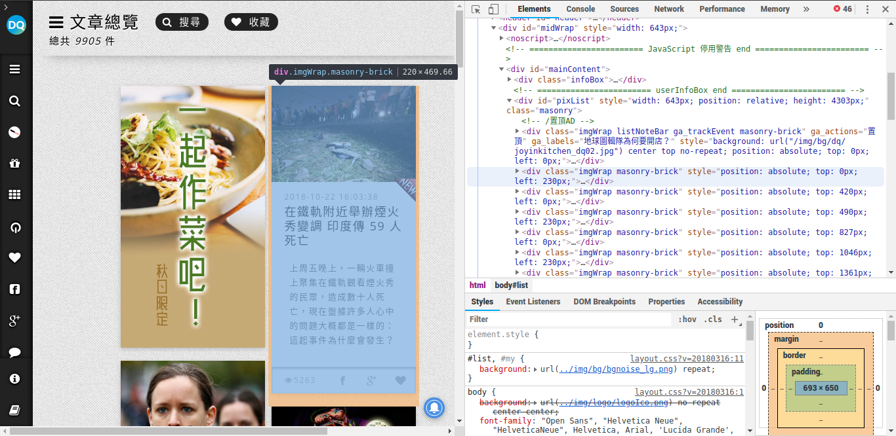
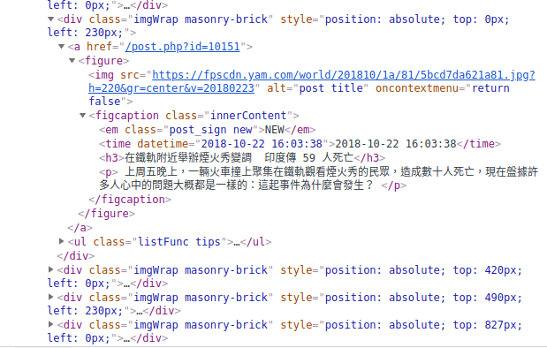
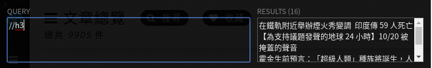
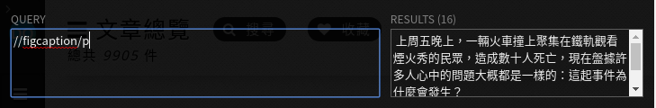
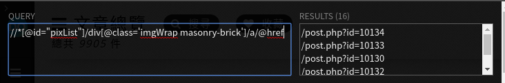

```{r setup, include=FALSE}
knitr::opts_chunk$set(echo = TRUE)
```

------

# 地球圖輯隊 https://dq.yam.com/

抓個不一樣一點的新聞網頁，「地球圖輯隊」大多是以報導國際間的新聞為主，如果受夠了爆料公社或是行車記錄器，還是看點國外的大事吧。

1. 以入該引的library。該引的太多了，不如引天吧

```{r}
library(tidyverse)
library(rvest)
library(httr)
library(dplyr) 
options(stringsAsFactors = F)
```

2. 打開要抓的網頁看小秘密\^q^



可以看到地球圖輯隊的新聞都被放在class名為'imgWrap masonry-brick'之下（上面那個listNoteBar開頭的是廣告）。



繼續挖，在'imgWrap masonry-brick'之下，新聞標題和內文被放在\<figcaption>這個tag裡面，新聞連結則是在父層的\<a>href裡面。





用xpath去找，發現標題最好抓，整個網頁只有新聞標題用到\<h3>這個標籤，直接全域搜索//h3就好。其次是內文，在\<ficaption>標籤之下也只有他用到段落\<p>。其他的也大多用這個方法，除了連結有夠詭異等一下匯出狀況。

總而言之，決定用習慣的xpath去找路徑。

3. 讀取網頁

```{r}
url <- "https://dq.yam.com/list.php"
doc   <- read_html(url)
```

4. 抽取節點
```{r}
# 就剛剛說的h3標籤
titlepath <- '//h3'

# 發佈時間和內文都算好找
timepath <- '//figcaption/time'
contentpath <- '//figcaption/p'

# 新聞觀看人數就藏在比較裡面的地方
viewpath <- '//ul/li[1]/span/text()'

# 下面開始讀，並用length()函數檢查這幾個有沒有都抓到相等的數量
title_ <- html_text(html_nodes(doc, xpath = titlepath))
length(title_)
time_ <- html_text(html_nodes(doc, xpath = timepath))
length(time_)
content_ <- html_text(html_nodes(doc, xpath = contentpath))
length(content_)
view_ <- html_text(html_nodes(doc, xpath = viewpath))
length(view_)
```

```{r}
# 現在開始抓連結，因為我已知第一個連結是廣告，所以我本來的想法是抓
# //*[@id="pixList"]/div[@class='imgWrap masonry-brick']/a/@href
# 但我怎麼抓都抓不到...只好繞遠路抓全部的連結，再把第一個連結刪掉

linkpath <- '//*[@id="pixList"]/div/a'
link_ <- html_attr(html_nodes(doc, xpath = linkpath), "href")

# 刪掉第一個廣告連結，留下有用的
link_ = link_[2:length(link_)]

# 補上前面，在檢查，應該要跟上面的大家一樣多個
link_ <- paste0("https://dq.yam.com/", link_)
length(link_)

# 好ㄉ我們抓完第一頁啦，先暫時把定存成dataframe這樣比較好看
tmp <- cbind(title_, content_, time_, view_, link_)
tmp <- as.data.frame(tmp)
head(tmp)

```

5. 接著抓很多頁，然後合在一起

按幾次下一頁就可以發現「地球圖輯隊」的網頁命名邏輯是在網址的最後面加上?page=n來指定到第n頁（?page=1就是預設的第一頁，可以省略掉，但加上去也不會怎樣），所以我們可以很簡單的透過一個變數去抓下一頁的內容。

```{r}
#前輟
pre <- "https://dq.yam.com/list.php?page="

# 指定要抓幾頁，就先抓十頁吧
page <- 10

# 先清空我們最後要放的東西
all_title_ <- c()
all_time_ <- c()
all_content_ <- c()
all_view_ <- c()
all_link_ <- c()

# 迴圈
for(p in 1:page){
	url <- paste0(pre,p)
  doc <- read_html(url) 
  
  # 跟上面一樣
  titlepath <- '//h3'
  timepath <- '//figcaption/time'
  contentpath <- '//figcaption/p'
  viewpath <- '//ul/li[1]/span/text()'
  
  # 每次都把抓到的東西和已經有的東西（all開頭的vector）合併
  title_ <- html_text(html_nodes(doc, xpath = titlepath))
  all_title_ <- c(all_title_,title_)
  time_ <- html_text(html_nodes(doc, xpath = timepath))
  all_time_ <- c(all_time_,time_)
  content_ <- html_text(html_nodes(doc, xpath = contentpath))
  all_content_ <- c(all_content_,content_)
  view_ <- html_text(html_nodes(doc, xpath = viewpath))
  all_view_ <- c(all_view_,view_)
  
  linkpath <- '//*[@id="pixList"]/div/a'
  link_ <- html_attr(html_nodes(doc, xpath = linkpath), "href")
  link_ = link_[2:length(link_)]
  link_ <- paste0("https://dq.yam.com/", link_)
  all_link_ <- c(all_link_,link_)
  
}

# 最後大合併成df
df <- cbind(all_title_,all_content_,all_time_,all_view_,all_link_)
df <- as.data.frame(df)

# 加上df的Column名稱
colnames(df) <- c('新聞標題','新聞摘要','發佈時間','觀看人數','新聞連結')

# 檢查是否抓到每頁16篇*10頁=共160篇新聞
nrow(df)

#欣賞一下
head(df)
```

6. 最後寫入rds

```{r}
# 寫入dq.rds的檔案
saveRDS(df, file = "dq.rds")
```